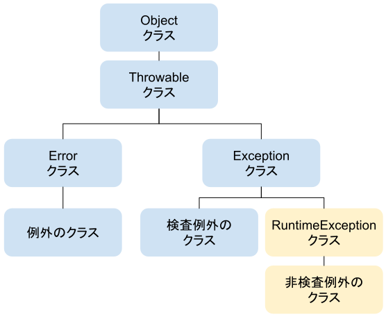

# rxjava
### Basics
- `Subscribe/ Observer` を使用する場合、`onCompleted`が呼ばれた際に、購読解除がされるため、unsubscribe を呼ばなくても良い.
- Disposanble の dispose メソッドを読んでも外部から購読解除が可能.
### Cold/ Hot producers
- `Cold`: `データのタイムライン`を Subscribe する時ごとに必ず生成する = データストリームには常に一つのサブスクライバー
- `Hot`: `データのタイムライン`は全体で一つで、消費者は同じタイムラインに参加することで、データを受け取る(別々の消費者が同時に Subscribe できる) = 過ぎてしまったデータは取得できない.

#### `Cold` -> `Hot` 変換
- `ConnectableFlowable` `ConnectableObservable`を使う.
- `refCount`: `ConnectableFlowable` `ConnectableObservable` を `Flowlable`, `Observable`に変換する. 変換する際に, 他の消費者に購読されている限りは途中から購読されても同じタイムライン情で生成されるデータを返す.(つまり, Hot な振る舞いをする)
- `autoConnect`: `ConnectableFlowable`/ `ConnectableObservable` が引数で指定した数の購読数に達した時に、自動的に subscribe メソッドを呼ぶ. 引数がない場合は、最初に subscribe メソッドが呼ばれたタイミングで処理を開始する. `autoConnect` で生成された, Flowable/ Observable は再度 subscribe を読んでも`再度処理を走ることはない`.

#### `Hot` -> `Cold` 変換
- `publish`: この処理で変換された `ConnectableFlowable`/`ConnectableObservable`は処理を開始した後に購読された場合、それ以降に生成されたデータから新たな消費者に対して通知をする.
- `replay`: publish と違って、生成したデータをキャッシュから再度生成して通知する. そのあとは同様な cold の処理。引数がない場合、全てキャッシュから生成し通知。引数がある場合、指定した個数や期間のデータをキャッシュする.
- `share`:  `ConnectableFlowable`/`ConnectableObservable` を生成せずに、hot な振る舞いをする Flowable/ Observable を作成する。実施的には, `flowable.publish().refCount()`と同様.  

### Many kinda of methods
- `FlowableProcessor` /`Subject` : Publisher と Subscriber の両方の性能を持っている interface
  - `FloableProcessor`: 他の publisher を subscribe することでデータを受け取れる consumer になることができ、さらに自分を subscribe している consumer に大してデータを通知することができる. 
  - `Subject`: Observable/ Observer の構成に使用される interface
  - Processor/ Subject の種類:
    - `PublishProcessor`/ `PublishSubject`: データを受け取ったタイミングでしか消費者（Subscriber/Observer）にデータを通知しない.
    - `BehaviorProcessor`/ `BehaviorSubject`: 消費者を登録した直前のデータをバッファし、それから消費者に通知.
    - `ReplayProcessor/ ReplaySubject`: 受け取った全てのデータを途中から登録した消費者にも通知.
    - `AsyncProcessor/ AsyncSubject`: データの生成が完了した後（onCompleted）に最後に受け取ったデータのみ消費者に通知. 
      - onNext が呼ばれるのが最後の要素だけで、onCompleted を呼ばないと要素が流れてこないというのが少し独特. 値が一つしか流れてこない or 最後の一つしか必要でない時に使う.
    - `UnicastProcessor/ UnicastSubject`: 一つの消費者からしか購読されない
  - `DisposableSubscriber/ DisposableObserver`: 購読解除機能を外部に出すことができ、非同期に安全にできるようにした Subscriber/ Observer.
    - `dispose` を内部で呼ぶ. 自分で実装できる interface は onStart のみ
  - `ResourceSubscriber/ ResourceObserver`: `DisposableSubscriber/ DisposableObserver` と同様な機能に加えて、add メソッドから複数の disposable を格納することができる.
    - **完了時やエラー時に自動で dispose メソッドが呼ばれない点に注意**
  - これらの disposable を subscribe に渡して、戻り値として取得したい場合は、`subscribeWith` を使う.
  - `CompositeDisposable`: 複数の disposable をまとめることで、CompositeDisposable の dispose を呼ぶことで、保持している全ての Disposable の dispose メソッドを呼ぶことができる.
  - `Maybe`: 通知するデータが一つだけあ流のかないのか不明なクラス - 消費者は `MaybeObserver`
  - `Completable`: データを通知せずに、完了だけ通知するクラス - 消費者は `CompletableObserver`
### 非同期処理 - 排他制御など
- `volatile`: java は変数を更新した時に変数のメモリにすぐに書き込まないで、キャッシュする。（毎回メモリを書き換えに行くのは効率が悪いため.）そのため、複数のスレッドからその変数にアクセスした時に、メモリにある古い値を取得してしまい値の不整合が発生してしまうことがある。
  - これを解決する方法として、volatile 修飾子を使用する。volatile は変数の値を更新した時にキャッシュせずに直接メモリを更新するように指定することができる。これにより常に最新の値を取得することを保証する。
- method 内で一連の操作を行う場合、値の atomic 性（原子性）を保証できない. -> java の concurrent atomic package を使用. その一連の処理を実行している間は、他のスレッドから atomic として宣言された変数にアクセスできないように排他制御することができる. (i.g. `AtomicInteger`)
- `synchronized`: atomic package は変数に対して適応するが、複数の変数を同じスレッドの同じタイミングで更新したい場合（例えば、point(x, y)など）は atomic 性を担保できない. -> synchronized を使用.
  - `synchronized` にロックしたいオブジェクトを渡す（この場合、ロックオブジェクトが必要となるメソッド全てに synchronized を付ける必要がある）か、メソッドのコードブロックに　`synchronized` を付けてメソッドを保有するオブジェクトをロックオブジェクトとし、その synchronized メソッドが呼ばれている間は、他のスレッドからはその synchronized メソッドまたは他の synchronized メソッドを呼ぶことはできないようにする.
  - `dead lock`: 二つのスレッドが互いに別のオブジェクトをロックし、その synchronized メソッドで他方のロックオブジェクトを参照している場合に発生する. 互いに参照が必要なオブジェクトがロックされているため、処理が一向にブロックされてしまう.
  
### 実行スレッド
- `just` や `from` などのメソッドすでにあるデータから生成される場合はメインスレッド上で動く Flowable/ Observable が生成される
- `timer` や `interval` メソッドなど時間に関わる処理を行う Flowable/ Observable の場合はメインスレッドとは異なるスレッド上で動く Flowable/ Observable が生成される.

### オペラータで Flowable/ Observable を生成する時のデータの流れる順番に関して 
- オペレータ内で生成される Flowable/ Observable はメソッドによってはそれぞれ異なるスレッド上で処理を行う. そのため、データが受け取った順に通知されることが保証されなくなる.(例 flatMap)

### エラーハンドリング
#### 考慮されるべきエラー内容
- 瞬間的なネットワークエラーなど再実行すれば回複するエラー など
#### エラーハンドリングの方法
- 消費者へのエラー通知: onError で受け取る. onError を実装していないと error の stacktrace が出力されるだけで特に何もしないため購読が続行される.
- 処理の再実行（リトライ）: 処理を最初からやり直す. この場合、消費者にエラーは通知されない.
- 代替データによる通知
#### 詳細
- 通知時の処理中に発生したエラーを通知するのかそのままスローするのかについては、Exceptions クラスの throwIfFatal メソッドで定義されている.(`VirtualMachineError` のようにエラーを通知されても回復不能な場合など.)

### 検査例外/ 非検査例外
- `(コンパイル時の) 検査例外`: テキストファイルの読み込みや SQL でデータを取得するなどは、`エラーが発生することを想定すべき例外` (例. `IOException`, `FileNotFoundException`, `SQLException` = Throwable と Throwable のすべてのサブクラスのうち、RuntimeException、Error のどちらのサブクラスでもないクラス) [Check Exception](https://docs.oracle.com/javase/jp/8/docs/api/java/lang/Exception.html)
  - メソッドを呼ぶ側で try-catch を行う場合、メソッドが呼ばれる側に `throws 句`の記述が必要
  - メソッドが呼ばれる側(= エラーが発生するメソッドの内側)で try-catch を行う場合は、throws句 の記述は不要
- `非検査例外`: それ以外の例外(クラスでいうと `RuntimeException` クラスとその配下の例外クラスのこと -> 変数が `null` の場合に発生する `NullPointerException` 等)

#### Exception に関して重要事項
- `非検査例外`は例外処理の記述(try-catch)がなくてもコンパイルエラーにならない
- try-catch がない状態で`非検査例外`が発生した場合、`例外は呼び出し元に投げられる`
- 例外が拾われずに呼び出し元に投げられ続け、`main で終わった場合は落ちる`
- 例外が処理されず呼び出し元に投げられることを例外の`伝播`という
- `非チェック例外` (`unchecked exception`)とも呼ばれる
- Error クラスの配下の例外では、`OutOfMemoryError` 等があり、`回復不能のエラー`と言われる。try-catch は必須ではない
- Exception クラスとそのクラス配下の例外では、`FileNotFoundException` 等があり、try-catch が必須. 検査例外と呼ばれる
- メソッドまたはコンストラクタの `throws 節`で非チェック例外を宣言する必要がないのは、それらの例外がそのメソッドまたはコンストラクタの実行によってスローされ、そのメソッドまたはコンストラクタの`境界の外側に伝播する可能性がある場合`である
#### 主な非検査例外のクラス
|  Exception Name  |  Description  |
| ---- | ---- |
|  NullPointerException  |  null ポインタへのアクセス  |
|  ArrayIndexOutOfBoundsException  | 配列の添字の不正  |
|  IllegalArgumentException  |  引数の値のエラー  |
|  ArithmeticException  |  0 による除算  |
- [RuntimeException](https://docs.oracle.com/javase/jp/8/docs/api/java/lang/RuntimeException.html)
#### Throwable
- throw できるのは Throwable とそのサブクラス. 
- スロー可能オブジェクト(Throwable)には、原因 (このスロー可能オブジェクトが構築される原因となった別のスロー可能オブジェクト)を含めることもできる。この原因情報の記録は`例外チェーン機能`と呼ばれ、それは`原因自体に原因がある`、といった具合に例外の「チェーン」(各例外がそれぞれ別の例外の原因となる)が形成されるためである.
- [Throwable オブジェクトに原因を関連付ける方法](https://docs.oracle.com/javase/jp/8/docs/api/java/lang/Throwable.html)
#### いつ throws 句を使うか
- 検査例外の場合
- 呼び出し側に不正があることを明示したいときは throws 句を使って、そのメソッドを呼び出したメソッドに例外を投げる(try-catch の捕捉を移譲) 
- 呼び出される側（メソッドを呼ぶ側の操作となんら関係ない処理で Exception が発生してしまう場合）に不正がある場合は、その中で try-catch で適切に捕捉させる.
- 意図的にどの部分で Exception が発生しているのかを分けると可読性が高まる. [throwsを用いるかどうかはメソッドの役割で決まる](https://www.atmarkit.co.jp/ait/articles/0611/22/news144.html)